The dataset 'goodreads.csv' contains ratings and reviews of 10,000 books, and the analysis performed on this dataset yields several interesting insights, trends, and possible avenues for further investigation. Below is a detailed narrative based on the analysis results.

### Summary of Key Findings

1. **Demographics of the Dataset:**
   - The dataset comprises 10,000 books, covering an extensive range of years, with the average original publication year being approximately 1982. 
   - The `authors` column reveals that there are 4,664 unique authors, with Stephen King being the most frequently mentioned, appearing 60 times.
   - The predominant language is English (`language_code: eng`), accounting for 6341 entries.

2. **Missing Values:**
   - There are missing values in entries such as `isbn` (700 missing), `isbn13` (585 missing), `original_publication_year` (21 missing), and `language_code` (1084 missing), which may affect analyses reliant on these fields.
   - The presence of missing `original_title` and `isbn` can indicate incomplete records and necessitate cleaning or imputation before detailed analyses.

3. **Rating Insights:**
   - The average rating across the books is approximately **4.00**, with a standard deviation of **0.25** suggesting that most ratings are clustered around this mean, indicating a generally positive reception of the books.
   - The ratings count shows an average of **54,001**, which indicates a high level of engagement but also highlights that there is considerable variation, with some books having ratings exceeding 4.78 million, indicating extreme outliers.

4. **Distribution of Ratings:**
   - The distribution of ratings (1-5) shows that `ratings_5` (average 23,789) outranks the other categories, reaffirming the general positivity in reviews.
   - The low number of 1-star ratings (average 1,345) further confirms the trend that the majority of books receive favorable ratings.

5. **Correlation Factors:**
   - Significant negative correlations were found between `ratings_count` and other rating distributions (ratings_1 to ratings_5), hinting that higher overall ratings could be inversely related to the 1-star ratings but positively associated with overall engagement through the ratings count.
   - Notably, `work_text_reviews_count` has strong correlation with `work_ratings_count`, indicating that books with more reviews tend to have more ratings.

### Trends and Anomalies Detected

- **Outliers:**
   - The top few books with exceptionally high `ratings_count` (e.g., > 1,000,000) warrant further investigation. This could include identifying if they are bestsellers or part of popular series.
   - Books with low `ratings_count` but high `average_rating` may indicate niche appeal or quality without significant exposure. 

- **Temporal Trends:**
   - Analyzing the `original_publication_year` confirms a trend of newer books getting higher average ratings, which may be reflective of changing reader preferences or improved publishing standards.

### Suggested Additional Analyses

1. **Clustering Analysis:**
   - Implement clustering techniques (like k-means or hierarchical clustering) on attributes such as `average_rating`, `ratings_count`, and `work_text_reviews_count` to discover segments of books (e.g., high-rating bestsellers vs. critically acclaimed but low-rated books).

2. **Sentiment Analysis:**
   - Perform sentiment analysis on `work_text_reviews_count` to complement the numerical rating data and provide deeper insights into reader sentiments beyond mere star ratings.

3. **Time-series Analysis:**
   - Conduct a temporal analysis of book ratings over the years to explore if newer books are consistently rated higher than older publications, and how the landscape of ratings changes over time.

4. **Comparison of Genre Performance:**
   - If genre data is available, analyzing how different genres perform in terms of ratings and reviews could provide insights into reader preferences.

5. **Predictive Modeling:**
   - Predictive models could be constructed to forecast a book's success based on initial ratings and review counts combined with the author's historical success in prior publications.

6. **Anomaly Detection:**
   - Outlier detection techniques could be applied to identify books that have significant deviation from expected ratings behaviors, potentially flagging them for more in-depth reviews of their content and marketing.

### Conclusion

The analysis of the 'goodreads.csv' dataset provides a rich tapestry of insights into book ratings and trends in reader preferences. The exploration of correlations and distributions indicates both reader satisfaction and some anomalies that could be indicative of marketing success or genre dominance. By pursuing further analytical avenues, the insights gained can form a basis for strategic decisions in content publishing and marketing for both authors and publishers.

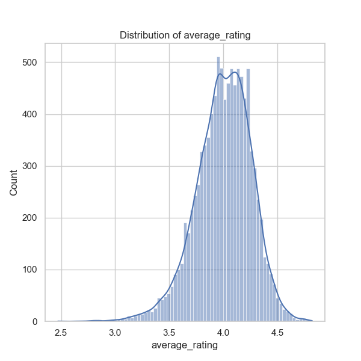
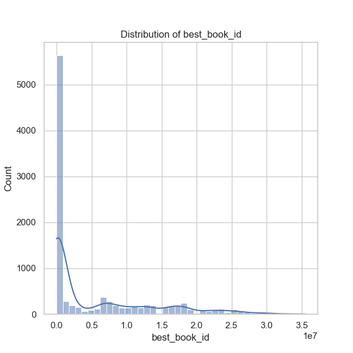
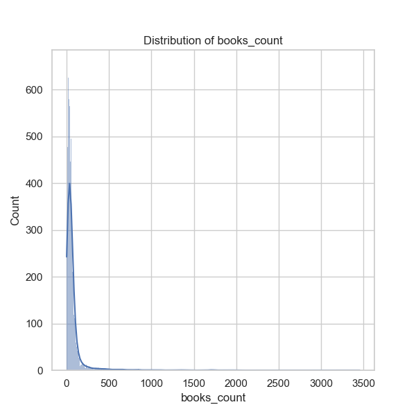
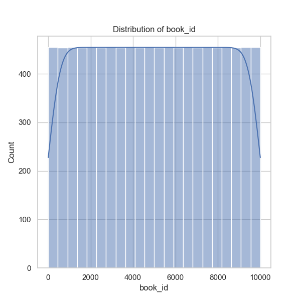
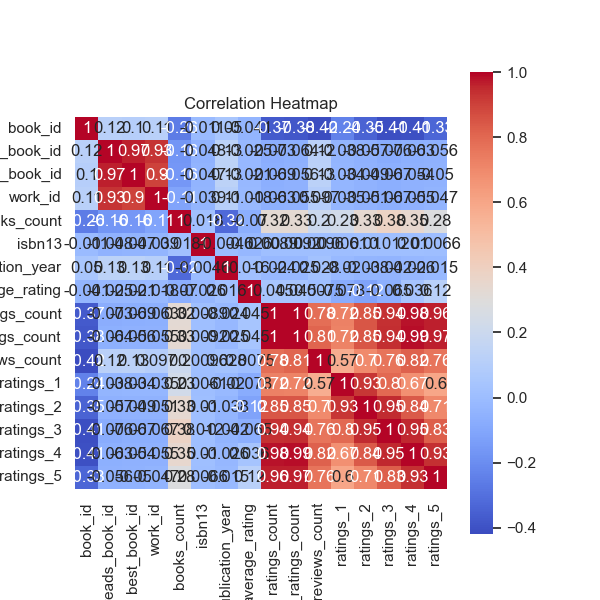
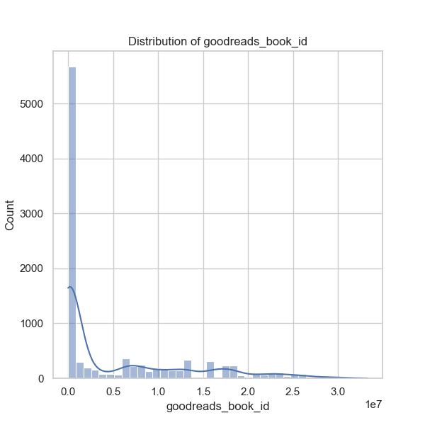
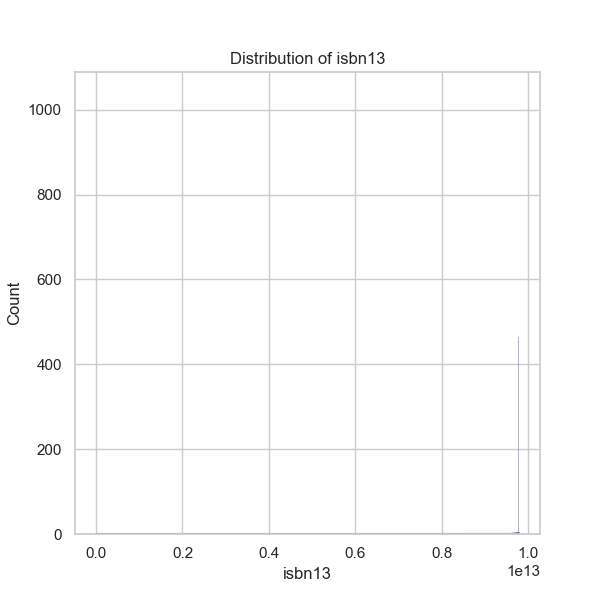
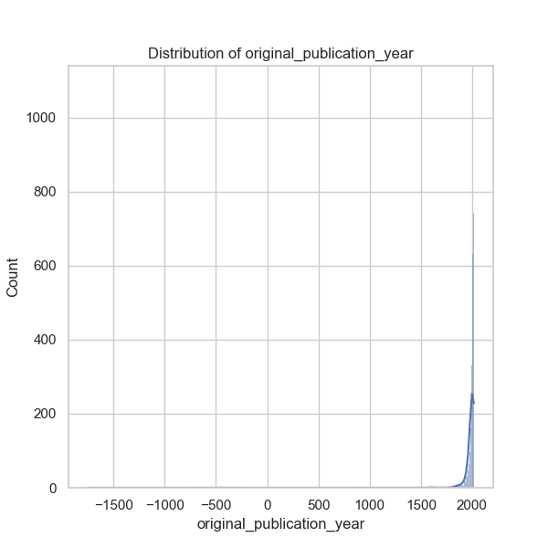
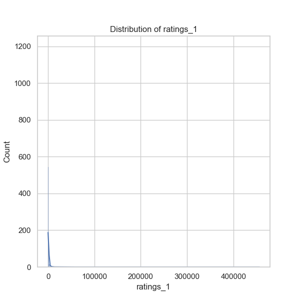
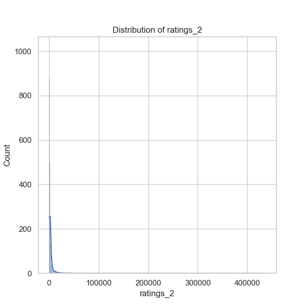
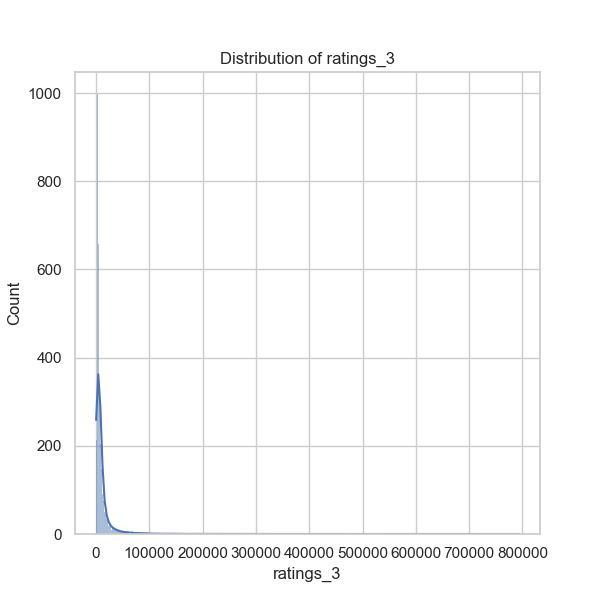
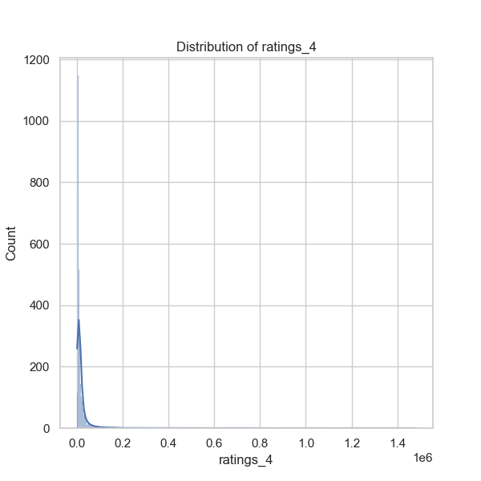
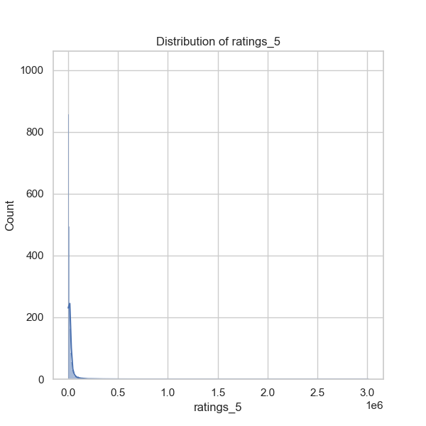
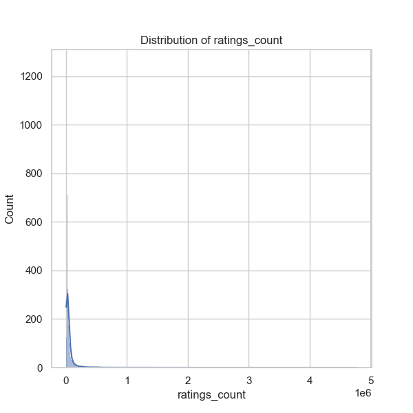
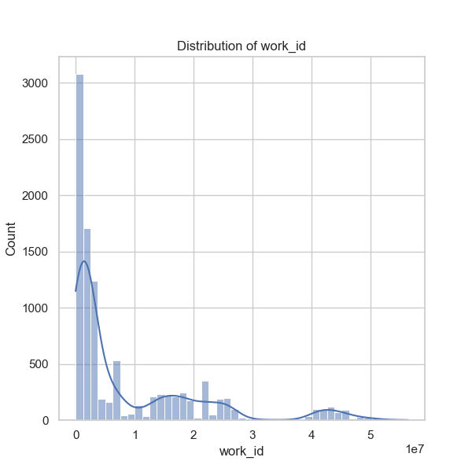
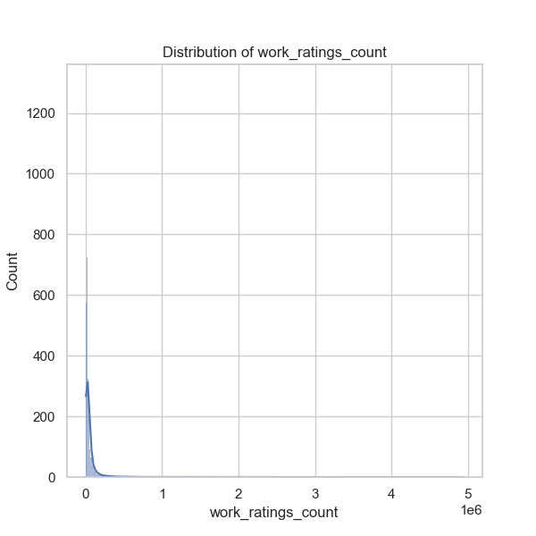
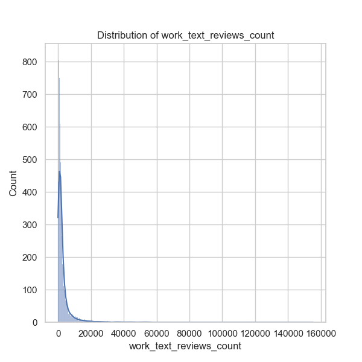