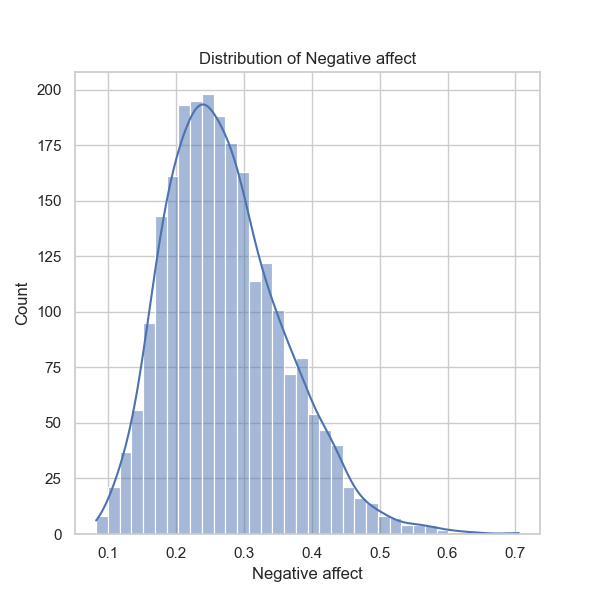

**Narrative Based on Data Analysis of `happiness.csv`**

### Overview of the Dataset
The dataset encompasses 2,363 entries reflecting a diverse range of happiness metrics across 165 countries from 2005 to 2023. The key variables examined include subjective well-being, which is quantified as the "Life Ladder", alongside various social and economic indicators such as GDP per capita, social support, healthy life expectancy, and perceptions of corruption.

### Summary Statistics
1. **Temporal Analysis**:
   - The dataset spans from 2005 to 2023, with a mean year of approximately 2014.76. This relatively wide range offers an opportunity to analyze trends over time in the happiness metrics.
   - The years are evenly distributed, with notable variations across these years.

2. **Happiness Metrics**:
   - **Life Ladder** has a mean score of 5.48, suggesting a moderate level of happiness reported across nations, with observed minimum and maximum values of 1.281 and 8.019, respectively. 
   - The average **Log GDP per capita** reflects economic health, with a mean around 9.40. The considerable variation in this column suggests distinct economic disparities among countries, influencing life satisfaction.
   - The **Social Support** metric averages 0.81, indicating good social connectedness in many countries, though some display low levels of support.
   - The indicators related to **Positive Affect** (mean 0.65) and **Negative Affect** (mean 0.27) show a positive outlook overall, as the former is relatively high and the latter is relatively low on a 0-1 scale.

### Missing Values
- The analysis identifies varying degrees of missing data across multiple columns, particularly for **Generosity**, **Perceptions of Corruption**, and **Healthy Life Expectancy**. This could potentially skew results if not addressed, and further care needs to be taken when interpreting analyses.

### Correlation Insights
- **Strong Correlations**:
   - There are pronounced correlations between the `"Life Ladder"` measurement and several variables, notably:
      - **Log GDP per capita (0.78)**: Indicating that as GDP increases, life satisfaction tends to rise.
      - **Social Support (0.72)**: Suggesting that networks and communities are significant in contributing to overall happiness.
      - **Healthy Life Expectancy (0.71)**: Healthier populations report higher satisfaction levels, underscoring the importance of health in life quality.

- **Negative Correlations**:
   - There are significant negative correlations observed between:
      - **Life Ladder** and **Perceptions of Corruption (-0.43)**: Implies that perceptions of corruption can negatively impact happiness levels. 
      - **Social Support** and **Negative Affect (-0.45)**: Showing higher social support is associated with lower negative feelings.

### Trends and Patterns
1. **Economic Impact on Happiness**:
   - The data suggests that wealthier nations, as measured by GDP, tend to report higher levels of happiness. However, happiness appears to be influenced not just by wealth but also by social factors.

2. **Social Connections Matter**:
   - Higher social support appears to correlate with increased life satisfaction, reinforcing the message that mental health resources and community support are critical factors.

3. **Health Factors Significantly Influence Life Satisfaction**:
   - Healthy life expectancy is integral to well-being, indicating that nations focusing on healthcare may yield better happiness scores.

### Suggestions for Further Analysis
1. **Clustering Analysis**:
   - Implement clustering techniques such as K-means or hierarchical clustering to classify countries into groups based on similar metrics of happiness. This could identify patterns and outliers in countries that might not adhere to typical trends.

2. **Time Series Analysis**:
   - Conduct a longitudinal analysis of happiness metrics over the available years to observe shifts and trends in well-being, particularly looking at factors that may lead to increases or decreases over time.

3. **Predictive Modeling**:
   - Develop regression models to predict happiness levels based on significant predictors identified in the correlation matrix. Machine learning methods could also be utilized to uncover more complex relationships.

4. **Outlier Detection**:
   - Use statistical anomaly detection techniques to identify countries that exhibit unexpectedly high or low happiness scores in relation to their economic and social metrics.

5. **Comparative Analysis**:
   - Conduct comparisons between regions, observing how cultural, political, or economic factors may shape life satisfaction differently across geographical boundaries.

### Conclusion
The dataset provides profound insights into the determinants of happiness across countries, showing a clear interdependence between economic status, social support, and overall well-being. The findings present avenues for policy recommendations aimed at improving societal happiness by enhancing economic conditions and social infrastructures. Future analyses can further illuminate the complexities of happiness and its determinants on a global scale.

