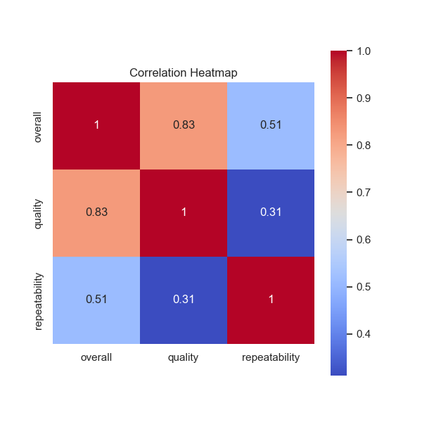
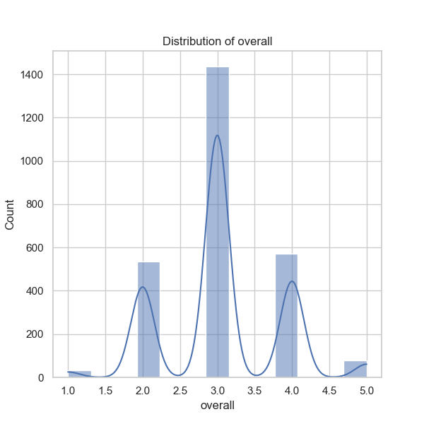
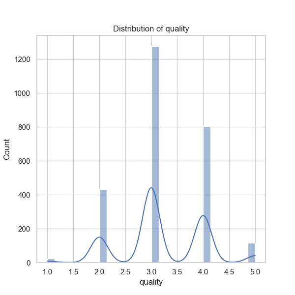
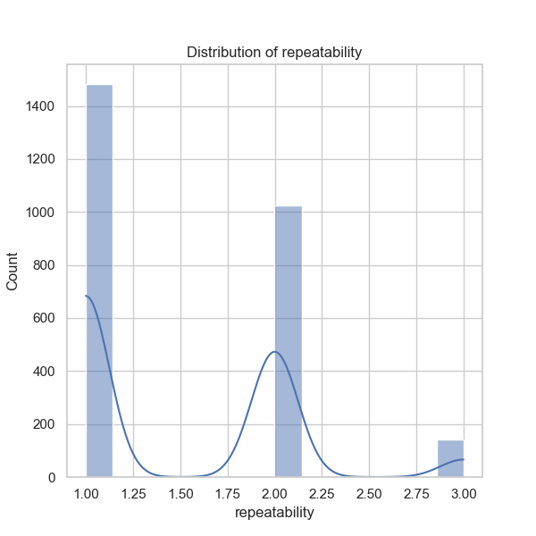

## Data Analysis Narrative for 'media.csv'

### Overview
The dataset 'media.csv' comprises information related to various media items, capturing their properties such as date of entry, language, type, title, contributor, and ratings on overall performance, quality, and repeatability. It contains a total of 2,652 entries, split across 8 different media types and captured in 11 languages.

### Summary Statistics
1. **Date**: With a total of 2,553 date entries recorded, there are 99 missing values indicating some issues with data integrity; characterized by 2,055 unique dates, with the most common entry being '21-May-06', appearing 8 times.
  
2. **Language**: The dataset predominantly features English entries (1,306 counts), followed by other languages, which cumulatively represent 10 additional language types.

3. **Type**: The media types are diverse, but movies dominate significantly with 2,211 appearances, suggesting a potential bias or focus on this type.

4. **Titles**: A total of 2,312 unique titles exists, with 'Kanda Naal Mudhal' being the most frequently cited title (9 occurrences).

5. **Contributors**: The contributor "Kiefer Sutherland" appears 48 times, indicating a possible concentration of media contributed by certain well-known personalities.

6. **Ratings**:
   - **Overall Ratings**: The average overall rating is approximately 3.05 with a standard deviation of 0.76 suggesting most ratings cluster around the mean with some variability.
   - **Quality Ratings**: Averaging at around 3.21, indicating a general favorability towards the quality of entries, but with a wider spread (std dev of 0.80).
   - **Repeatability Ratings**: The average is low (1.49), with a majority showing a tendency to rate items as repeatable only at low levels, indicating perhaps a lack of re-engagement with the media.

### Missing Values
The presence of 99 missing values in the 'date' column warrants further investigation, especially considering that the rest of the columns do not have missing entries apart from 'by', which has 262 missing values. This could indicate a pattern where specific records were submitted without a contributor's name.

### Correlation Insights
On evaluating the correlation:
- **Overall vs. Quality** has a strong positive correlation (0.83), suggesting that media rated highly for quality are likely also rated well overall.
- **Overall vs. Repeatability** shows a moderate correlation (0.51), which could imply that better overall-rated media are somewhat more likely to be revisited.
- **Quality vs. Repeatability** has a weak correlation (0.31), indicating quality does not significantly influence the likelihood of a media item being rated repeatedly.

### Observations and Insights

1. **Media Dominance**: The overwhelming prevalence of movie titling hints towards a skewed dataset, where other genres may be underrepresented. Tracking other types could yield a more balanced understanding of media consumption.

2. **Language Representation**: The dominance of English in the dataset may signal a bias that could limit understanding of non-English media performance or trends.

3. **Quality vs. Repeatability**: The low repeatability scores suggest that even high-quality media may not prompt viewers to engage repeatedly. This might warrant an exploration into the nature or type of media that prompts repeat viewing or engagement.

4. **Potential Outliers**: Instances of high overall ratings coupled with low repeatability could be identified as outliers worthy of further exploration. Determining if these represent one-time hits rather than enduring favorites may provide valuable insights into media marketing strategies.

### Suggestions for Further Analysis
1. **Clustering Analysis**: Applying clustering techniques could help identify natural groupings of media based on ratings and engagement levels, offering insights into audience segments.

2. **Anomaly Detection**: Employ anomaly detection methods to find unusual patterns in ratings or missing data entries which could signify data entry issues or unique events influencing media ratings.

3. **Time Series Analysis**: With date entries available, performing a time series analysis could uncover trends over time—are ratings improving or declining, and how do they align with different points in time or genre popularity?

4. **Text Analysis on Titles**: Analyzing the titles for common keywords or patterns could provide insights into what types of media attract higher ratings or are more repeated.

5. **Multivariate Regression**: Understanding how different factors (language, type, contributor) impact overall and quality ratings through regression analysis could offer predictive capabilities for future media entries.

### Conclusion
The analysis of 'media.csv' offers a window into the performance and characteristics of media items within a predominately English-speaking, film-centric dataset. The correlations and observed trends call for strategic investigations to maximize understanding and engagement with diverse media outputs.

